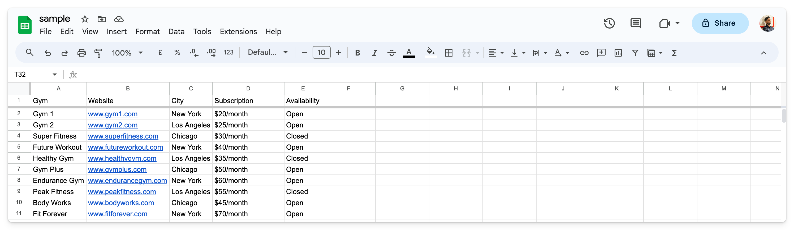
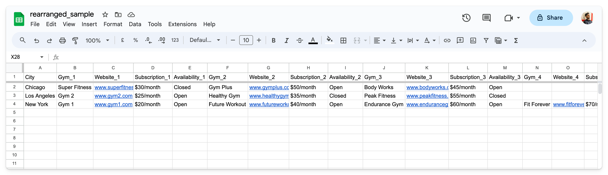

# Rearrange Rows to Columns

A Python code that rearranges rows to columns based on a data point in the CSV file. The rearranged data can be used for [programmatic SEO](https://untalkedseo.com/) or for other projects.

You can take a look at the below screenshots to understand more.

### Before



### After



> Just to clarify, I first downloaded the data from Google Sheets as CSV and then uploaded the rearranged data again (that you see in the screenshot).

## How to use

You need to have Python installed on your computer to use this, if not already, install from their [official website](https://www.python.org/).

Now, follow the following steps to get it working:

### 1. Prepare your local folder

Clone or download this repository to your computer and put your CSV file in the same folder.

### 2. Install the Pandas library

Install the Pandas library by using the following command. You may need to use `pip3` instead of `pip` depending upon your configuration.

```
pip install pandas
```

### 3. Modify the required code

Replace `sample.csv` with the name of your CSV file and then `City` with the name of the column that you want as the primary column, in the `app.py` file in the following line:

```
rearrange_data('sample.csv', 'City')
```

For example, if your CSV file is named `coffee-shops.csv` and you want to make the `country` column as the main column, then the modified line would be:

```
rearrange_data('coffee-shops.csv', 'country')
```

### 4. Run the code

After everything is set, it's time to execute your Python code by using the following command in the terminal (should be open in the same folder). Again, you may need to use `python3` instead of `python`, depending upon your configuration.

```
python app.py
```

And after the execution completes, you will have the **rearranged CSV file** in the same folder.

Note that it may take a lot of time depending upon how big your input CSV file is and also your computer's processing power.